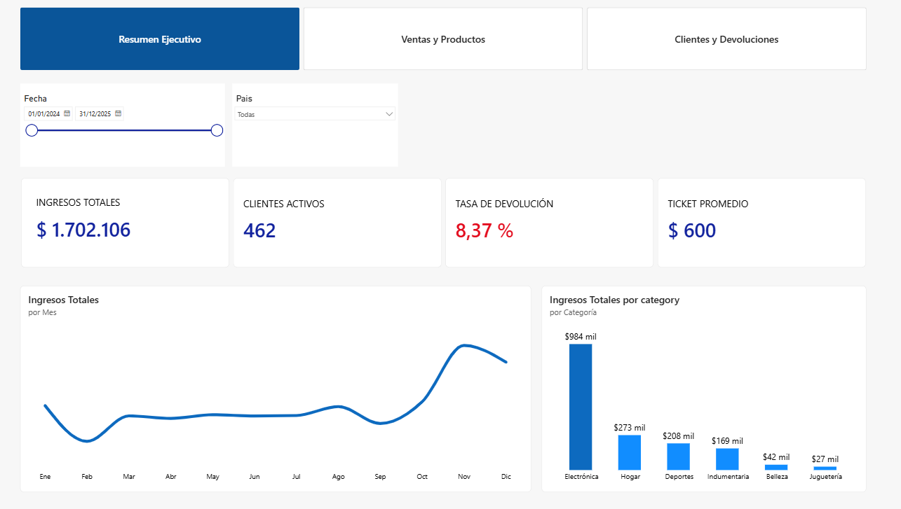
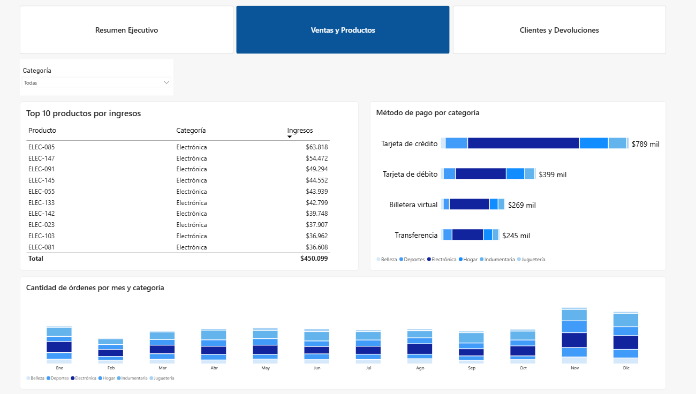
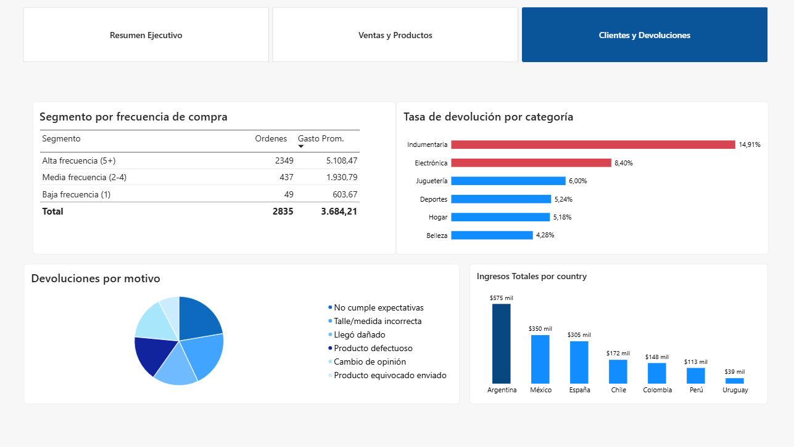

# 📊 Análisis de E-commerce — Ingresos, Devoluciones y Segmentación de Clientes

Proyecto de análisis de datos end-to-end sobre un dataset sintético de e-commerce: generación de datos, modelado relacional, exploración en SQL, dashboard en Power BI y un modelo predictivo de devoluciones.

> **Nota sobre los datos**: el dataset es **sintético y generado con asistencia de IA** (Claude, de Anthropic) a partir de criterios que definí yo — dominio, tablas, cantidad de filas, relaciones entre entidades (estacionalidad, tasas de devolución por categoría, antigüedad de cliente vs. frecuencia de compra). El código de generación está en [`scripts/generate_data.py`](scripts/generate_data.py). Más detalle en la sección [Metodología](#-metodología-y-uso-de-ia) más abajo. No corresponde a un negocio real.

---

## 🎯 Objetivo del proyecto

Responder tres preguntas de negocio típicas de un equipo de BI en e-commerce:

1. ¿Qué categorías de producto generan más ingresos?
2. ¿Qué categorías tienen mayor tasa de devolución?
3. ¿Qué segmento de clientes compra con más frecuencia, y cuánto aporta al ingreso total?

Y complementarlo con un modelo predictivo que estima la probabilidad de devolución de una orden.

---

## 🗂️ Estructura del repositorio

```
ecommerce-analytics-project/
├── data/                    # Datasets fuente en CSV (4 tablas relacionadas)
│   ├── customers.csv        # 500 clientes
│   ├── products.csv         # 150 productos, 6 categorías
│   ├── orders.csv           # 3.000 órdenes (2024–2025)
│   └── returns.csv          # 251 devoluciones
├── database/
│   └── ecommerce.db         # Base SQLite con las 4 tablas + índices
├── sql/
│   └── queries.sql          # Queries comentadas para las 3 preguntas de negocio
├── dax/
│   ├── medidas_dax.txt              # Medidas base (ingresos, devoluciones, segmentos)
│   └── medidas_dax_dashboard.txt    # Medidas adicionales del dashboard (KPIs, ranking, MoM)
├── scripts/
│   ├── generate_data.py     # Generación del dataset sintético (numpy/pandas)
│   ├── eda.py                # Exploración de datos (EDA)
│   └── model.py               # Modelo de regresión logística (predicción de devoluciones)
├── docs/
│   └── resumen_hallazgos.md # Resumen ejecutivo de los hallazgos del EDA y el modelo
├── dashboard/
│   ├── ecommerce-analytics-project.pbix  # Archivo real de Power BI — abrí este para explorar el dashboard interactivo
│   ├── mockup_dashboard.html # Mockup navegable de las 3 páginas del dashboard
│   └── screenshots/          # Capturas reales del dashboard final en Power BI
│       ├── 01_resumen_ejecutivo.png
│       ├── 02_ventas_y_productos.png
│       └── 03_clientes_y_devoluciones.png
└── README.md
```

---

## 🧱 Modelo de datos

Esquema relacional en estrella, con `orders` como tabla de hechos central:

```
customers (1) ───────< orders (*) >─────── (1) products
                          │
                          │ (1:1)
                          ▼
                       returns
```

| Tabla | Filas | Clave primaria | Relación |
|---|---|---|---|
| `customers` | 500 | `customer_id` | 1 cliente → N órdenes |
| `products` | 150 | `product_id` | 1 producto → N órdenes |
| `orders` | 3.000 | `order_id` | tabla de hechos |
| `returns` | 251 | `return_id` | 1 orden → 0 o 1 devolución |

---

## 🛠️ Stack técnico

- **Python** (pandas, numpy, scikit-learn) — generación de datos, EDA, modelado
- **SQL / SQLite** — consultas analíticas y almacenamiento relacional
- **Power BI** — modelado semántico (DAX) y dashboard interactivo
- **DAX** — medidas de negocio (ingresos, tasa de devolución, segmentación RFM simplificada)
- **Claude (Anthropic)** — asistencia de IA para la generación del dataset sintético y como apoyo de consulta durante el desarrollo (ver sección de Metodología)

---

## 🧠 Metodología y uso de IA

Este proyecto combina trabajo propio con asistencia de IA, y quiero ser transparente sobre en qué parte se usó cada una:

**Lo que definí yo:**
- El dominio del proyecto (e-commerce) y las preguntas de negocio a responder.
- La estructura de tablas necesaria (clientes, productos, órdenes, devoluciones) y cómo debían relacionarse.
- Los criterios de diseño del dataset: cantidad de filas por tabla, qué relaciones debían existir entre variables (por ejemplo, que la categoría de producto influyera en la tasa de devolución, o que la fecha de compra tuviera estacionalidad).
- Las decisiones de modelado en Power BI: qué páginas armar, qué visualizaciones usar para cada pregunta, cómo segmentar a los clientes.
- La revisión, interpretación y corrección de todos los resultados (incluyendo debug de errores reales de configuración regional en Power BI que aparecieron durante la carga de datos).

**Lo que generó Claude (IA) a partir de mis instrucciones:**
- El script de Python que genera el dataset sintético (`scripts/generate_data.py`), siguiendo la estructura y relaciones que yo especifiqué.
- Las queries SQL iniciales y las fórmulas DAX, que después validé y adapté sobre el modelo real.
- Este mismo README y el mockup de layout del dashboard.

La idea de este proyecto no es simular que programé cada línea desde cero, sino mostrar cómo pensar y dirigir un análisis de datos de punta a punta — incluyendo el uso criterioso de herramientas de IA como parte del flujo de trabajo real de un analista hoy en día.

---

## 🚀 Cómo reproducir el proyecto

### 1. Generar los datos
```bash
cd scripts
pip install pandas numpy scikit-learn
python generate_data.py
```
Esto regenera los 4 CSV en `data/` con semilla fija (`random seed = 42`), así los resultados son reproducibles.

### 2. Cargar a SQLite
Los datos ya están cargados en `database/ecommerce.db`. Para regenerarlo desde los CSV:
```python
import pandas as pd, sqlite3
conn = sqlite3.connect('database/ecommerce.db')
for t in ['customers','products','orders','returns']:
    pd.read_csv(f'data/{t}.csv').to_sql(t, conn, if_exists='replace', index=False)
```

### 3. Correr las queries
Abrí `sql/queries.sql` en cualquier cliente SQLite (DB Browser for SQLite, DBeaver) apuntando a `database/ecommerce.db`.

### 4. Abrir el dashboard en Power BI
El archivo real ya está incluido en el repo: [`dashboard/ecommerce-analytics-project.pbix`](dashboard/ecommerce-analytics-project.pbix). Descargalo y abrilo directo con Power BI Desktop (gratuito, disponible solo para Windows) — no hace falta reconstruir nada, ya tiene el modelo, las relaciones y las medidas DAX cargadas.

Si preferís reconstruirlo desde cero como ejercicio:
1. "Obtener datos" → "Texto o CSV" → importá los 4 archivos de `data/`.
2. Armá las relaciones según el esquema de arriba.
3. Pegá las medidas de `dax/medidas_dax.txt` y `dax/medidas_dax_dashboard.txt`.
4. Usá `dashboard/mockup_dashboard.html` y las capturas en `screenshots/` como referencia de layout.

---

## 🖼️ Capturas del Dashboard

### Página 1 — Resumen Ejecutivo
KPIs generales, tendencia mensual de ingresos e ingresos por categoría.



### Página 2 — Ventas y Productos
Top 10 productos por ingresos, método de pago por categoría y estacionalidad de órdenes.



### Página 3 — Clientes y Devoluciones
Segmentación por frecuencia de compra, tasa de devolución por categoría, motivos de devolución e ingresos por país.



---

## 📈 Hallazgos clave

| Pregunta | Resultado |
|---|---|
| Categoría con más ingresos | **Electrónica** — $984 mil (58% del total), muy por encima de Hogar ($273 mil) y Deportes ($208 mil) |
| Categoría con más devoluciones | **Indumentaria** — 14,91% de tasa de devolución (casi 2x el promedio general de 8,37%) |
| Segmento más valioso | **Alta frecuencia (5+ órdenes)** — 2.349 de 2.835 órdenes totales, gasto promedio $5.108,47 vs. $603,67 en clientes de baja frecuencia |
| País con mayor ingreso | **Argentina** — $575 mil, seguido de México ($350 mil) y España ($305 mil) |
| Método de pago líder | **Tarjeta de crédito** — $789 mil (46% del total) |
| Motivo de devolución | Repartido entre "No cumple expectativas", "Talle/medida incorrecta" y "Producto defectuoso" como las tres causas principales |

**KPIs generales**: $1.702.106 en ingresos totales, 462 clientes activos, ticket promedio de $600, tasa de devolución global de 8,37%.

> Los valores de esta tabla son los finales, extraídos directamente del dashboard en Power BI (capturas de arriba). Los números preliminares en `docs/resumen_hallazgos.md` provienen del EDA en Python y pueden diferir levemente por redondeo.

Detalle completo, incluyendo el modelo predictivo y sus limitaciones, en [`docs/resumen_hallazgos.md`](docs/resumen_hallazgos.md).

---

## 🤖 Modelo predictivo

Regresión logística para estimar probabilidad de devolución por orden.

- **AUC-ROC**: 0.59
- **Insight principal**: la variable con mayor peso es la *categoría del producto* (Indumentaria, Electrónica), no el comportamiento de compra (monto, cantidad, medio de pago). Esto sugiere que el riesgo de devolución es un atributo del producto, no del cliente — información accionable para priorizar control de calidad por categoría en vez de scoring de clientes.

Código completo en [`scripts/model.py`](scripts/model.py).

---

## ⚠️ Limitaciones

- Dataset sintético: las relaciones (estacionalidad, tasas de devolución) fueron inyectadas deliberadamente para fines didácticos.
- El poder predictivo del modelo (AUC 0.59) es esperable dado que el dataset fue diseñado con señal concentrada en una sola variable categórica.
- No incluye variables de comportamiento histórico del cliente (devoluciones previas, reviews) que en un dataset real mejorarían sustancialmente el modelo.

---

## 📌 Próximos pasos

- [ ] Segmentación RFM completa (Recencia, Frecuencia, Monto)
- [ ] Modelo de forecasting de ventas (series de tiempo)
- [ ] Publicar el dashboard en Power BI Service para tener un link interactivo además del `.pbix` descargable

---

## 👤 Autor

Proyecto de práctica de análisis de datos — SQL, Python y Power BI, con asistencia de IA (Claude, Anthropic) para la generación de datos y documentación. Ver sección [Metodología](#-metodología-y-uso-de-ia) para el detalle de qué se hizo con y sin IA.
